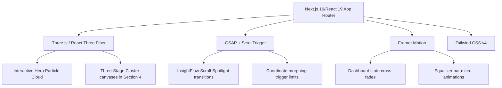

# Xai – Intelligence Workspace
### Product Experience Prototype & Design-to-Code Engineering Execution
**Prepared for:** RacoAI Frontend Engineering Challenge  
**Prototype URL:** [xai-workspace.vercel.app](https://xai-workspace.vercel.app)  
**Code Repository:** [github.com/ashik-racoai/xai-workspace](https://github.com/ashik-racoai/xai-workspace)  
**Figma File Link:** [Figma Design Link](https://www.figma.com/design/nIA9tZFp8SWQPPL6zevbJl/Untitled?node-id=0-1&t=kxy29yHTcyMCaDcf-1)

---

## 1. Executive Summary & Design Vision

**Xai – Intelligence Workspace** is a high-fidelity interactive product experience prototype built to demonstrate how unorganized data transforms into structured intelligence, actionable insights, and automated workflows. 

Rather than presenting a static landing page, the prototype implements a product-quality, single-page layout centered around intentional motion, visual constraints, and interactive WebGL canvases. 

### Core Narrative:
> **Raw Data (Chaos)** $\rightarrow$ **Structured Intelligence (Process)** $\rightarrow$ **Actionable Insight (Order)** $\rightarrow$ **AI Automations**

### Visual Philosophy:
- **Restraint & Polish:** Modeled after top-tier developer products (Stripe, Linear, Vercel) utilizing a strict color palette, micro-line borders, clear margins, and modern high-density typography (Google Font Inter).
- **Interactive Depth:** Replacing stock assets with active WebGL representations using React Three Fiber, allowing users to physically rotate, zoom, and repel points to understand the geometry of intelligence.
- **Micro-choreography:** Elements animate into view with custom easing timelines, and indicators respond directly to user hover inputs and viewport positioning.

---

## 2. Interface Decomposition & Page Structure

The single-page experience is structured into four distinct focus sections, each mapping to a narrative milestone of the data transformation journey:

### Section 1: Hero Section (Data $\rightarrow$ Intelligence)
*   **Aesthetic:** Bold sans-serif typography, large headlines, and distinct badge chips set against a pitch-black background with subtle ambient light gradients in the blur radius.
*   **Content:**
    *   **Eyebrow tag:** `INTELLIGENT WORKFLOWS` (Upper-case tracking-spaced pill indicator).
    *   **Headline:** *“From raw data to actionable intelligence.”*
    *   **Subtext:** Concise product positioning detailing Xai’s capacity to capture data, clean it, and connect it to actions.
    *   **CTAs:** A primary solid purple button (`#7C6CFF`) alongside a subtle text-based link to watch a walkthrough demo.
*   **3D Visualizer:** An interactive React Three Fiber Canvas rendering a custom particle system. The points on the left float in a scattered, chaotic state (representing raw data) and connect via micro-lines to a steady 8x8 teal/green grid on the right (representing structured intelligence). Points on the left gently repel in response to mouse cursor movement in the viewport.

### Section 2: Interactive Insight Flow (Three Stages, One Flow)
*   **Aesthetic:** Minimal horizontal layout featuring three layout container cards. Focus is directed onto the active item via opacity transitions and glowing borders.
*   **Content:**
    1.  **Ingest Data (01):** Connecting databases, APIs, documents, or event streams.
    2.  **Analyze with AI (02):** Structuring, cleaning, and enriching files with AI models.
    3.  **Generate Insight (03):** Generating automated workflows and trigger logs.
*   **Interaction Strategy:**
    *   **Scroll-linked spotlight:** Powered by GSAP ScrollTrigger, as the section enters the center viewport, cards sequentially light up. The active card glows and expands, while inactive cards fade to 45% opacity.
    *   **Equalizer wave:** Each card terminates in an audio/data waveform widget. When a stage becomes active, the lines animate into a bouncing frequency wave showing processing activity. When inactive, they settle to flat, dark lines.
    *   **Hover Overrides:** Users can hover over blurred stages to manually override coordinates and inspect their features instantly.

### Section 3: Intelligence Dashboard Preview (Where Insight Becomes Action)
*   **Aesthetic:** High-density, professional SaaS dashboard design featuring a dark shell, rounded borders, and light text labels.
*   **Content:**
    *   **Sidebar Navigation:** Integrates tabs for **Tasks**, **Data Sources**, **Models**, **History**, **Integrations**, and **Settings**.
    *   **Header Module:** Control actions including custom filters, sharing parameters, and a primary trigger.
    *   **KPI Scorecards:** Displays metric details (Data Ingested: `1.84M`, Total Runs: `14`, Success Rate: `94.2%`, Automations Run: `37`) with color-coded status badges and ambient green pulsing lights.
    *   **Interactive Analytics:**
        *   **Left Chart:** "Model Runs" chart displaying alternating teal and purple bars. Hovering over a bar reveals a floating tooltip showing the specific integer count.
        *   **Right Logs:** A list of recent tasks logging execution times and statuses (`Completed` in green, `Processing` in flashing amber, `Failed` in red).
    *   **State Machine:** Click-selecting items in the sidebar updates the entire dashboard core state. New numbers, latency averages, and custom tasks animate into view via a Framer Motion `AnimatePresence` cross-fade.

### Section 4: Signature Interaction (The Self-Reorganizing Cluster)
*   **Aesthetic:** Side-by-side grid panels that represent the deep math and motion of the raw-data-to-order workflow.
*   **Content:**
    *   Three side-by-side active 3D WebGL canvases:
        1.  **Raw Data (Chaos):** 45 floating purple points drifting randomly in spherical space. Repelled dynamically by cursor hover.
        2.  **Structuring (Process):** 38 teal points mapping relationships. Dynamic lines draw segment networks between neighbouring nodes.
        3.  **Insight Grid (Order):** 64 green points organized inside a waving 4x4x4 structured mesh.
*   **3D Controls & HUDS:**
    *   **OrbitControls:** Users can use their mouse scroll wheels to zoom into each canvas and drag to spin coordinates in 3-dimensional space.
    *   **Click-to-Inspect HUD:** Clicking on any point inside the 3D canvases opens a detailed data terminal displaying node IDs, categorizations, and mapping metrics in real-time.
*   **Deliverables Block:** Clickable repository, deployment, and documentation cards leading to external files.
*   **Professional Footer:** A dark, wide footer bar aligning copyright statements, platform details, and terms.

---

## 3. Technology Stack & Implementation Choices

- **Framework:** Next.js (App Router, Turbopack compiling). Fully static pre-rendered routes optimized for Vercel deployment.
- **3D Graphics Engine:** Three.js wrapper React Three Fiber & `@react-three/drei`. Handles GPU-accelerated coordinate renderings. Point position calculations are computed inside React `useMemo` hooks using mathematical geometries to prevent redraw latency.
- **Scroll Timelines:** GSAP (GreenSock Animation Platform) v3 with ScrollTrigger. Used to bind layout states to viewport positions, ensuring frame-perfect synchronizations.
- **UI States & Choreography:** Framer Motion handles spring-based height adjustments, tooltip elevations, and tab layout transitions.
- **Styling Architecture:** Tailwind CSS v4 using semantic design variables (`bg`, `surface`, `border`, `accent`, `accent2`). Eliminates ad-hoc colors to ensure a cohesive typography theme.

---

## 4. Spacing, Typography & Layout Specifications

| Design Attribute | Value Specification | Rationale |
| :--- | :--- | :--- |
| **Primary Type** | `Inter` (sans-serif) | Clean, highly legible UI typography used by Stripe & Vercel. |
| **Headings** | Semibold, tracking-tight | Establishes a confident, professional structure. |
| **Section Spacing** | `py-28 px-8`, max-width `6xl` | Generous layout padding to convey a calm, uncluttered style. |
| **Borders** | `border-border/40` (`#26262B` half-opacity) | Muted line borders that establish hierarchy without crowding content. |
| **Accent Colors** | Purple (`#7C6CFF`) & Teal (`#33E5C7`) | Balanced palette representing core automation and intelligence. |
| **Backgrounds** | Dark (`#0B0B0C`), panels (`#131316`) | Sleek dark-mode environment matching modern SaaS products. |

---

## 5. Summary of Design-to-Code Adjustments Made

To ensure the completed application is functionally identical to the Figma design:
1.  **Updated Navigation Elements:** Replaced placeholder site links with uppercase tracking values (`DATA ENGINE`, `PLATFORM`, `INSIGHTS`, `DOCS`) and added `Register for 1.0` outline button.
2.  **Refined Hero Copy:** Restructured primary headings and paragraphs to explain the workspace vision exactly.
3.  **Removed Aspect-Border Placeholders:** Integrated the Hero 3D scene directly into the page backdrop by removing the solid grey container lines.
4.  **Redesigned Insight Flow Cards:** Stripped subtitle headers, added `01`, `02`, `03` markup indices, and built dynamic equalizer waveform bars that pulse under active states.
5.  **Rebuilt Dashboard Panel:** Programmed full state transitions, updating the performance column charts, task lists, and stats metrics dynamically depending on the selected sidebar element. Included interactive bar-chart hover tooltips.
6.  **Created Multi-Scene Signature Interaction:** Formatted a 3-column WebGL grid layout featuring Chaos, Process, and Order scenes with zoom capabilities, mouse click inspectors, and download cards linked to deliverables. Added standard legal site footers.

*This concludes the engineering and design documentation.*
